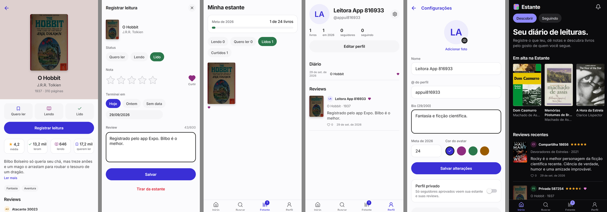

# Estante (app)

App mobile da [Estante](https://estante-pink.vercel.app), um diário de leituras no estilo Letterboxd,
só que para livros. Feito com **Expo** (React Native) e usando a mesma conta e os mesmos dados do site.



## Baixar

**[Baixar o APK para Android](https://github.com/gabrielvalenco/estante-app/releases/latest/download/estante.apk)** (sempre a versão mais nova; histórico em [Releases](https://github.com/gabrielvalenco/estante-app/releases)).
Abra o link no celular e, se o Android pedir, permita instalar apps desta fonte.

## O que dá para fazer

- Entrar com Google, GitHub ou e-mail e senha (a mesma conta do site)
- Buscar livros (Open Library) e leitores
- Marcar livros como quero ler, lendo ou lido com um toque
- Registrar a leitura: nota de meia em meia estrela, curtida, data em que terminou e review
- Estante com filtros e a meta de leitura do ano
- Perfis com diário, favoritos e reviews; perfil privado com pedido para seguir
- Feed de quem você segue e notificações (com aceitar/recusar pedidos)
- Marcador de página, citações e notas por livro, com citação por foto da página
- Discussões sem spoiler: cada um vê só até a página que leu
- Clubes de leitura privados: progresso do grupo e discussões só para os membros
- Retrospectiva do ano e planos (Brochura, Capa Dura e Ex Libris; a assinatura é feita no site)
- Foto de perfil (recorte quadrado, reduzida para 256px antes de enviar)
- Modo escuro automático

## Stack

- Expo SDK 57, Expo Router (rotas em `src/app/`), TypeScript
- TanStack Query para os dados, com atualização otimista na estante
- `expo-secure-store` para o token (Keychain/Keystore), `expo-image`, `expo-image-picker`, `expo-image-manipulator`
- Fonte Inter e ícones Lucide, com as mesmas cores do site
- API: rotas `/api/v1` do [repositório do site](https://github.com/gabrielvalenco/estante) ([documentação](https://github.com/gabrielvalenco/estante/blob/main/docs/api-v1.md))

## Rodando

```bash
npm install
npx expo start
```

Abra no celular com o **Expo Go** (QR code no terminal). Por padrão o app usa a API em produção.
Para apontar para o site rodando no seu computador:

```bash
EXPO_PUBLIC_API_URL=http://<ip-do-computador>:3100 npx expo start
```

## Gerando o APK

```bash
npx eas-cli@latest build --platform android --profile preview
```

O perfil `preview` gera um APK de teste (canal OTA `preview`). Para publicar uma versão, suba `version` no `app.json`, rode o perfil `production` e anexe o APK a um Release do GitHub com o nome `estante.apk`: o link de download do site e do app sempre aponta para o Release mais novo.

```bash
npx eas-cli@latest build --platform android --profile production
```

Atualizações só de JavaScript vão por OTA, para os dois canais:

```bash
npx eas-cli update --channel production --environment production --message "..."
```
